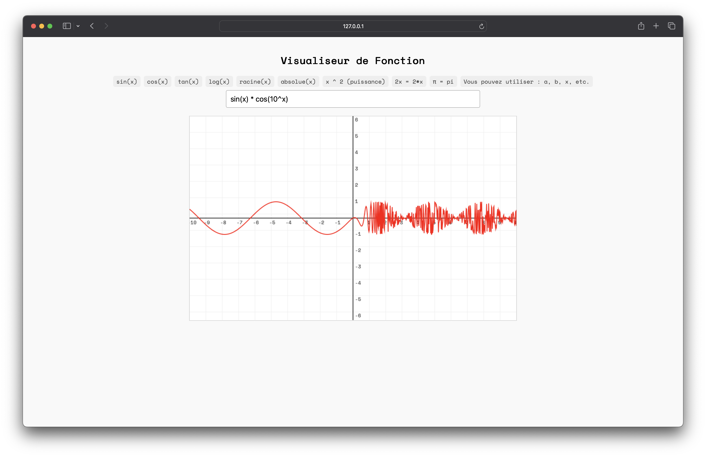

# Mathematical Graphing Tool in HTML/CSS/JS

This project is an **interactive web application** that allows you to visualize **mathematical functions** in real time on a 2D Cartesian coordinate system.

Mathematical Graphing link: [Mathematical Graphing](https://drichdev.github.io/Mathematical-Graphing-/)

---

## Preview

##  Features

- ✍️ Inline expression editor.
- 📊 Live graph rendering as you type.
- ✅ Supports standard functions: `sin`, `cos`, `tan`, `sqrt`, `abs`, `log`...
- 📐 Displays labeled axes with numeric ticks (X and Y).
- 🎨 Supports multiple functions at once (comma-separated).
- 📱 Responsive interface for desktop and mobile.
- 🔡 Uses monospaced font (Space Mono) for clean math-style rendering.

---

## 💡 Technologies Used

- **HTML**: For the structure and layout of the page.
- **CSS** (optionally with Tailwind): For responsive and minimalist design.
- **Vanilla JavaScript**: Handles math parsing, drawing, and user interactions.
- **HTML5 Canvas (2D API)**: For plotting functions in real time.